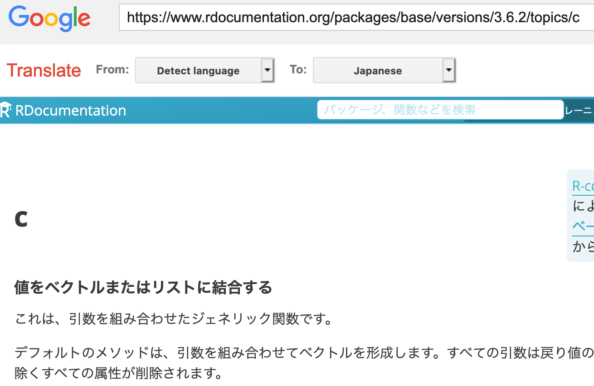

<!-- README.md is generated from README.Rmd. Please edit that file -->

```{r, include = FALSE}
knitr::opts_chunk$set(
  collapse = TRUE,
  comment = "#>",
  fig.path = "man/figures/README-",
  out.width = "100%"
)
library(transdoc)
```

# transdoc

<!-- badges: start -->
[](https://github.com/atusy/transdoc/actions)
<!-- badges: end -->

Translate text, web, and help documents with Google Translate

## Installation

``` r
remotes::install_github("atusy/transdoc")
```

<!--

You can install the released version of transdoc from [CRAN](https://CRAN.R-project.org) with:

``` r
install.packages("transdoc")
```

-->

## Examples

### Translate a help document

The replaced `?` launches your browser and shows a translated help.

``` r
library(transdoc)
options(transdoc_to = "ja")
?c
```




### Translate a text or a web site

``` r
translate("This text will be translated to Japanese", to = "default")
translate("https://transdoc.atusy.net", to = "ja")
```

### Set default destination language

Unless the destination language is set, it is taken as English.

``` r
options(transdoc_to = "ja")
```

You can see full list of available languages by the `language` object.
You can use either a name or a value of an element in the `language`.

```{r}
language
```
