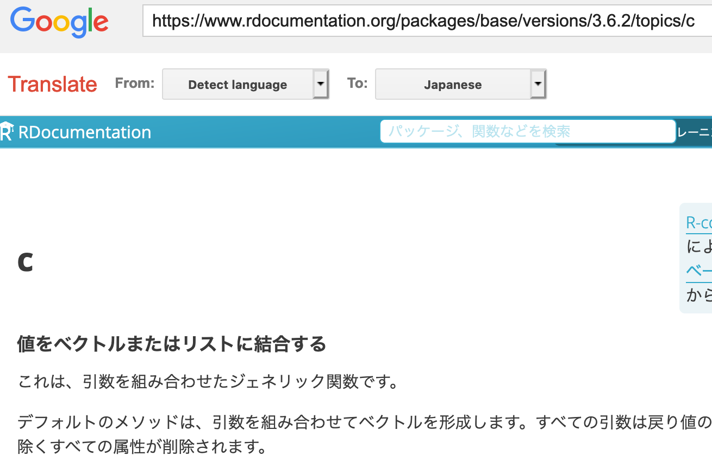

<!-- README.md is generated from README.Rmd. Please edit that file -->

# transdoc

<!-- badges: start -->

[](https://github.com/atusy/transdoc/actions)
<!-- badges: end -->

Translate text, web, and help documents with Google Translate

## Installation

``` r
remotes::install_github("atusy/transdoc")
```

<!--

You can install the released version of transdoc from [CRAN](https://CRAN.R-project.org) with:

``` r
install.packages("transdoc")
```

-->

## Examples

### Translate a help document

The replaced `?` launches your browser and shows a translated help.

``` r
library(transdoc)
options(transdoc_to = "ja")
?c
```



### Translate a text or a web site

``` r
translate("This text will be translated to Japanese", to = "default")
translate("https://transdoc.atusy.net", to = "ja")
```

### Set default destination language

Unless the destination language is set, it is taken as English.

``` r
options(transdoc_to = "ja")
```

You can see full list of available languages by the `language` object.
You can use either a name or a value of an element in the `language`.

``` r
language
#>           afrikaans            albanian              arabic         azerbaijani 
#>                "af"                "sq"                "ar"                "az" 
#>              basque          belarusian             bengali           bulgarian 
#>                "eu"                "be"                "bn"                "bg" 
#>             catalan  chinese_simplified chinese_traditional            croatian 
#>                "ca"             "zh-CN"             "zh-TW"                "hr" 
#>               czech              danish               dutch             english 
#>                "cs"                "da"                "nl"                "en" 
#>           esperanto            estonian            filipino             finnish 
#>                "eo"                "et"                "tl"                "fi" 
#>              french            galician            georgian              german 
#>                "fr"                "gl"                "ka"                "de" 
#>               greek            gujarati      haitian_creole              hebrew 
#>                "el"                "gu"                "ht"                "iw" 
#>               hindi           hungarian           icelandic          indonesian 
#>                "hi"                "hu"                "is"                "id" 
#>               irish             italian            japanese             kannada 
#>                "ga"                "it"                "ja"                "kn" 
#>              korean               latin             latvian          lithuanian 
#>                "ko"                "la"                "lv"                "lt" 
#>          macedonian               malay             maltese           norwegian 
#>                "mk"                "ms"                "mt"                "no" 
#>             persian              polish          portuguese            romanian 
#>                "fa"                "pl"                "pt"                "ro" 
#>             russian             serbian              slovak           slovenian 
#>                "ru"                "sr"                "sk"                "sl" 
#>             spanish             swahili             swedish               tamil 
#>                "es"                "sw"                "sv"                "ta" 
#>              telugu                thai             turkish           ukrainian 
#>                "te"                "th"                "tr"                "uk" 
#>                urdu          vietnamese               welsh             yiddish 
#>                "ur"                "vi"                "cy"                "yi"
```
